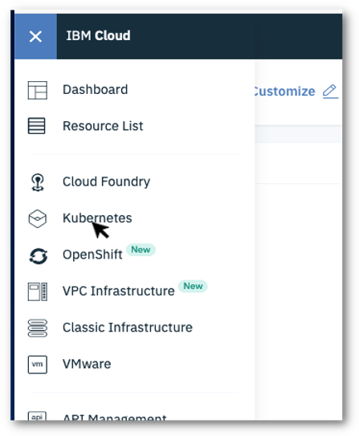
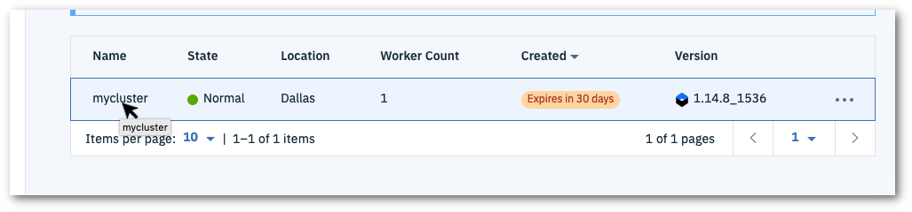

# Kubernetes_Challenge

Log in to the [IBM Cloud](https://cloud.ibm.com) to access the dashboard.

Click on the top left navigation menu and select **Kubernetes**.

Open the control panel for your cluster by clicking on the name.

Click on the **Web terminal** button.

# 1. Deploy your application

In this part of the lab we will deploy an application called webapp with image nginx with 5 replicas.

## Heading 2

*italics*

**List**

* something
* something  more

**URLs**

[Text over an URL](https://www.ibm.com)

**Images**

**Display tiles inside a series or tiles inside a tile**

To have include content(articles, blogs, series) within one tile or to create tiles within tiles,

* Create a series and use the following snippet as a template
* Host your child tiles in another private portal and host the main tile on your desired private portal

